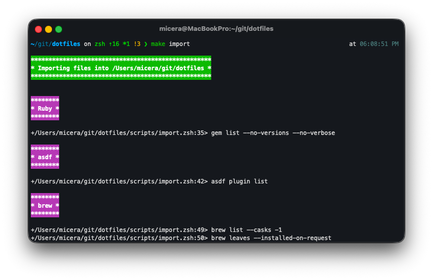

# My `.files`
`zsh` on macOS.

    

## Manual imports

- Rectangle (into [`.config/rectangle/RectangleConfig.json`](.config/rectangle/RectangleConfig.json))
- iTerm2 (into [`iterm2/com.googlecode.iterm2.plist`](iterm2/com.googlecode.iterm2.plist))

## Dependencies

- [Oh My Zsh](https://github.com/ohmyzsh/ohmyzsh)
- [Powerlevel10k](https://github.com/romkatv/powerlevel10k)
- [The Ultimate vimrc](https://github.com/amix/vimrc)
- [LazyVim](https://github.com/LazyVim/LazyVim)

## References
- [dotfiles.github.io](https://dotfiles.github.io/)
