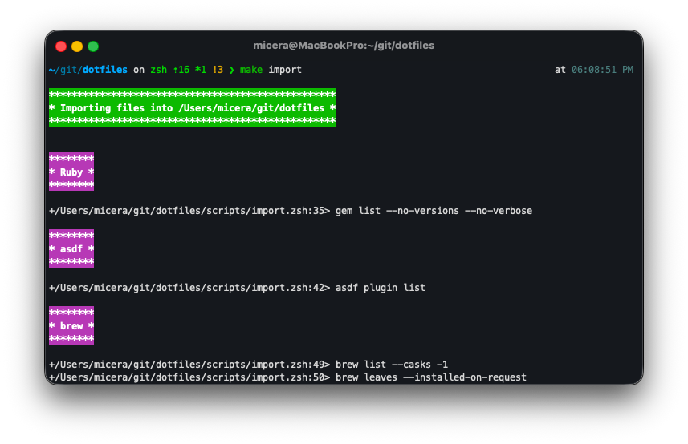

# My `.files`
`zsh` on macOS.

    

## Manual imports

- Rectangle (into [`.config/rectangle/RectangleConfig.json`](.config/rectangle/RectangleConfig.json))
- iTerm2 (into [`iterm2/com.googlecode.iterm2.plist`](iterm2/com.googlecode.iterm2.plist))

## Dependencies

- [Oh My Zsh](https://github.com/ohmyzsh/ohmyzsh)
- [Powerlevel10k](https://github.com/romkatv/powerlevel10k)
- [The Ultimate vimrc](https://github.com/amix/vimrc)
- [LazyVim](https://github.com/LazyVim/LazyVim)

## Running agents from the phone

Both tools are npm globals ([`npm/globals.txt`](npm/globals.txt)), not casks. The
desktop apps they also ship are not needed for either setup.

- **happy** wraps Claude Code so a session shows up on the phone. `alias claude="happy claude"`
  in [`zsh/.aliases`](zsh/.aliases) is the whole setup; plain `happy` does the same thing,
  since it drops a leading `claude` argument. Credentials live in `~/.happy/access.key`.
- **paseo** runs a local daemon the phone reaches through `relay.paseo.sh`, with the client
  at `app.paseo.sh`. The CLI has no autostart, so
  [`launchd/sh.paseo.daemon.plist`](launchd/sh.paseo.daemon.plist) runs `paseo start` at login.

Both binaries live in the prefix of whichever node mise has active, which is why
[`mise/config.toml`](mise/config.toml) pins one. Bumping that pin moves the prefix, so
reinstall both globals afterwards.

## References
- [dotfiles.github.io](https://dotfiles.github.io/)
